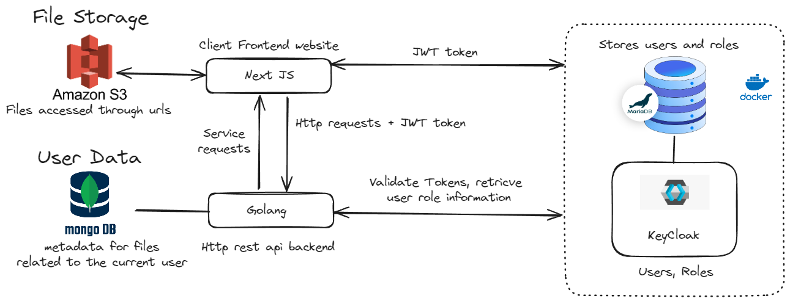
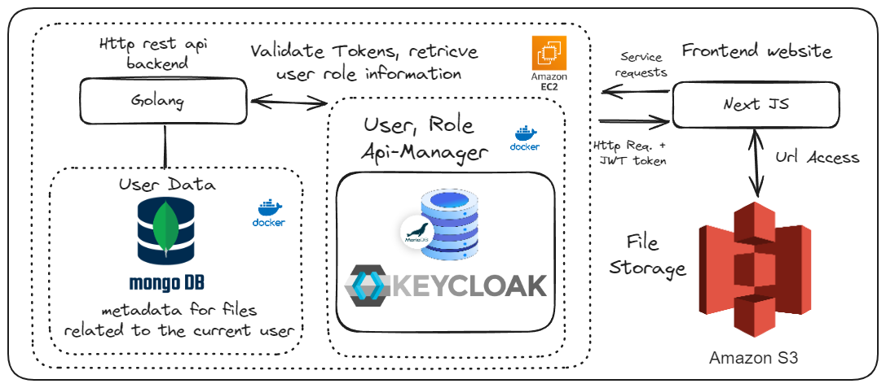

# Cloud_FileServer
Extending the File Server project written in Go to make more use of the cloud. Please read the roadmap below, for more information on the design choices please look at the research folder. 

Working Demo

### Current Set-up

# Project Roadmap

## ✅ Completed: Milestone 1: Authentication and Login

- Identified keycloak as an appropriate auth service. 
- Set up a user database to store user credentials securely.
- Develop a login page and authentication API endpoints.
- Able to implement access control here with keycloak by protecting end points as such we have removed that milestone
If you are looking to get started on keycloak yourself, I folowed a great tutorial [here](https://www.youtube.com/watch?v=1u8GlfKyB_Q&t=810s).

### milestone setup

## ✅ Completed:  File Upload and Storage :

- Allow users to upload files to the server. (If you want to know how I did this part, check out folder, "Learning MongoDB" a single file will show you how I connect to MongoDB and the S3 instance with handlers)
- upload meta data to the db which will hold file url and sign the URL before passing it back to the client.
- Integrate cloud storage on Amazon S3 service 

### milestone set-up

### To do for this milestone:
- ✅ We have a mongodb setup our backend needs to be able to access the db read and write
- ✅ Once we are able to store metadata here, download, upload etc (no actual files move) we move onto implementing s3. We have chosen to go with generating urls each time 
as such for each file the "s3bucket" and "s3ObjectKey" need to be stored in the mongodb, on file creation, allowing us to generate urls which can be passed back to the client.
I suggest that these urls be time limited.
- ✅Its all integrated in the example in "LearningMongoDB", we need to migrate these to our API and we will have a working backend! 

## 🚀 In Progress: Some Polish!

- We now have a working Rest API and appropriate interactions with the mongoDB, keycloak, and AmazonS3. Now we need to tie this all together!
- Make sure our routes, roles are protected correctly by keycloak.
- Front End, time to hop back into react and learn how we can interact with our new handler functions and the S3 instance.

## Video Streaming:
- rudimentary implementation already achieved by just pointing it to the s3 instance
- Integrate video streaming capabilities to allow users to stream video files stored on the server.
- Implement adaptive bitrate streaming for better performance across different network conditions.

## Final Cloud Migration:
- Well done, we are moving to the cloud!
- Here we will deploy our backend services, (mongoDB, rest API and keycloak) on an EC2 instance.
- need to configure networking, and allow access to the keycloak system 

# The rest of these milestones are considered extensions to the project 

## File Management and Sharing:
- Implement file organization features like folders or directories.
- Enable users to share files or folders with other users.
- Implement secure sharing mechanisms with options for setting permissions and expiration dates.

## Versioning and Revision History:
- Implement version control for files to keep track of changes over time.
- Allow users to revert to previous versions if needed.

## Search:
- Develop search functionality to allow users to search for files based on metadata or content.

## Content Delivery Network (CDN):
- Utilize a CDN to cache and deliver static assets like videos, improving performance and scalability.

## Transcoding and Encoding:
- Implement video transcoding and encoding services to support multiple formats and resolutions for streaming.

## Analytics and Monitoring:
- Set up monitoring and analytics tools to track server performance, user activity, and usage patterns.
- Implement logging to capture and analyze events for troubleshooting and optimization.

## Security Enhancements:
- Implement encryption for data at rest and in transit to ensure data security.
- Set up intrusion detection and prevention systems (IDS/IPS) to detect and mitigate security threats.

## High Availability and Scalability:
- Design the architecture for high availability with redundancy and failover mechanisms.
- Implement auto-scaling to handle varying loads and traffic spikes efficiently.

## Backup and Disaster Recovery:
- Set up regular backups of data stored on the server.
- Develop a disaster recovery plan and implement mechanisms for data restoration in case of failures.
